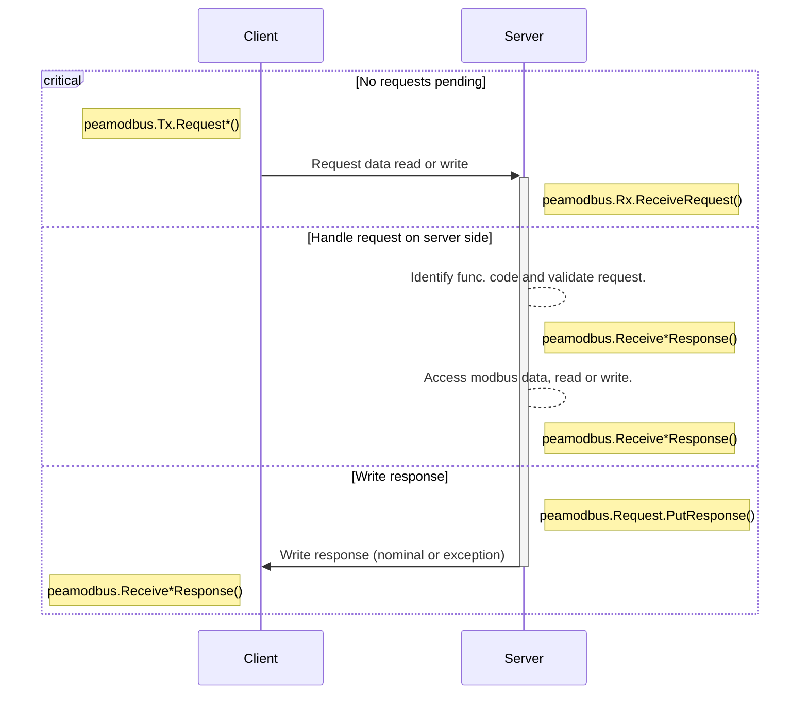

[](https://pkg.go.dev/github.com/soypat/peamodbus)
[](https://goreportcard.com/report/github.com/soypat/peamodbus)
[](https://opensource.org/licenses/MIT)
[](https://github.com/soypat/peamodbus/actions/workflows/go.yml)
[](https://codecov.io/gh/soypat/peamodbus)


# peamodbus
Fault tolerant, TCP modbus implementation in Go that just works. Apt for embedded systems.

This is a WIP.

## Protocol sequence diagram:

Mermaid Sequence diagram



## Examples
See up to date examples in [`examples`](./examples/) directory. These are just copy pasted from there and may occasionally be out of date.

### Modbus Server via TCP

<details><summary>Click to see TCP example</summary>

```go
package main

import (
	"context"
	"fmt"
	"log"
	"time"

	"github.com/soypat/peamodbus"
	"github.com/soypat/peamodbus/modbustcp"
)

// This program creates a modbus server that adds 1 to
// all holding registers on every client request.

func main() {
	dataBank := peamodbus.ConcurrencySafeDataModel(&peamodbus.BlockedModel{})
	sv, err := modbustcp.NewServer(modbustcp.ServerConfig{
		Address:        "localhost:8080",
		ConnectTimeout: 5 * time.Second,
		DataModel:      dataBank,
	})
	if err != nil {
		log.Fatal(err)
	}
	ctx := context.Background()
	for {
		if !sv.IsConnected() {
			fmt.Println("attempting connection")
			err = sv.Accept(ctx)
			if err != nil {
				log.Println("error connecting", err)
			}
			time.Sleep(time.Second)
			continue
		}
		err = sv.HandleNext()
		if err != nil {
			log.Println("error in HandleNext", err)
			time.Sleep(time.Second)
		} else {
			for addr := 0; addr < 125; addr++ {
				value, exc := dataBank.GetHoldingRegister(addr)
				if exc != 0 {
					panic(exc.Error())
				}
				dataBank.SetHoldingRegister(addr, value+1)
			}
		}
		if err := sv.Err(); err != nil {
			log.Println("server error:", err)
		}
	}
}
```

</details>

### Modbus Client RTU via USB
Reads from 2 registers in an instrument connected on a port using the [`go.bug.st/serial`](https://github.com/bugst/go-serial) library.

<details><summary>Click to see RTU example</summary>

```go
package main

import (
	"io"
	"os"
	"time"

	"github.com/soypat/peamodbus/modbusrtu"
	"go.bug.st/serial"
	"golang.org/x/exp/slog"
)

func main() {
	const (
		deviceAddress         = 86
		sensorRegisterAddress = 0
	)

	port, err := serial.Open("/dev/ttyUSB0", &serial.Mode{
		BaudRate: 9600,
		DataBits: 8,
		Parity:   serial.NoParity,
		StopBits: serial.OneStopBit,
	})
	if err != nil {
		panic(err)
	}
	defer port.Close()

	logfp, _ := os.Create("log.txt")
	defer logfp.Close()

	logger := slog.New(slog.NewTextHandler(io.MultiWriter(os.Stdout, logfp), &slog.HandlerOptions{
		Level: slog.LevelDebug,
	}))

	c := modbusrtu.NewClient(modbusrtu.ClientConfig{
		Logger: logger,
	})

	c.SetTransport(port)
	for {
		var tempHumidity [2]uint16
		err = c.ReadHoldingRegisters(deviceAddress, sensorRegisterAddress, tempHumidity[:])
		if err != nil {
			panic(err)
		}
		logger.Info("read", "humidity", float32(tempHumidity[0])/10, "temperature", float32(tempHumidity[1])/10)
		time.Sleep(time.Second)
	}
}
```

</details>